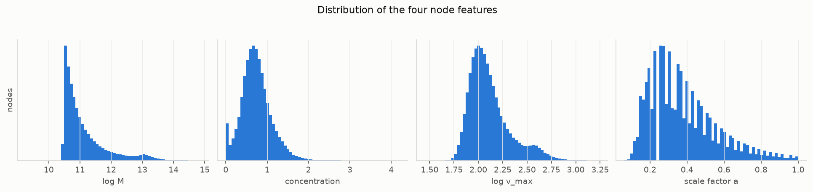
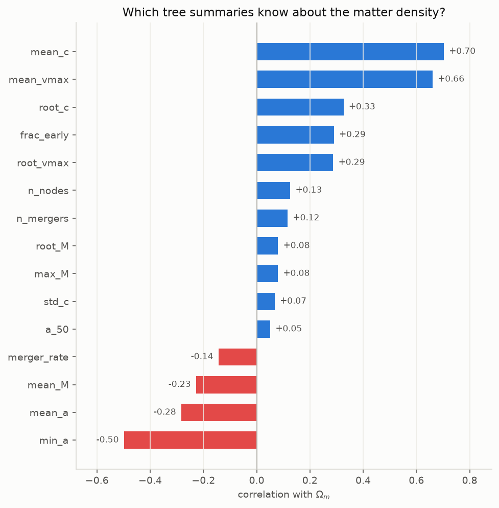
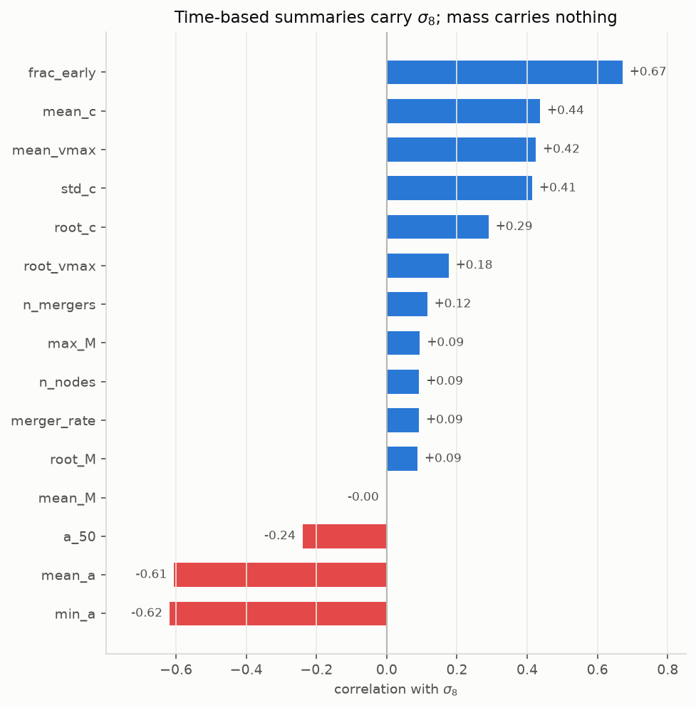
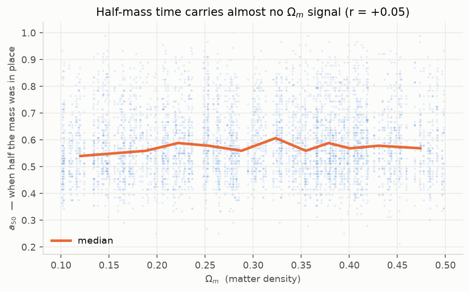
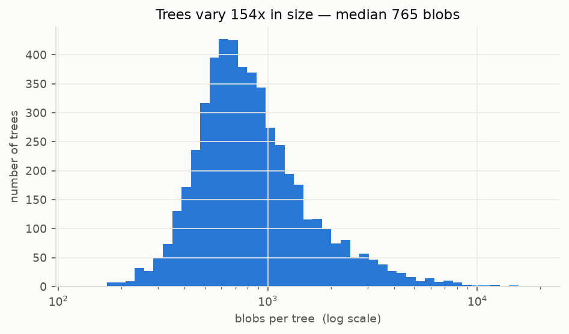

# Merger trees: what's in the data

Family histories of dark matter blobs. Everything here comes from running
`explore.py`, not from the paper.

Shared background (what the two dials mean, the vocabulary) lives in
[glossary.md](glossary.md).

---

## 4. How a tree is stored

A merger tree is the family history of one blob. Today there's one big blob;
going back in time it splits into the smaller blobs that merged to make it.

Load a `.pt` file → a plain **Python list**. Each item is one tree, stored as
**flat arrays**:

```
Data(x=[125, 4], edge_index=[2, 124], edge_attr=[124, 1], y=[1, 2])
```

**`x`, the blobs.** One row each, four columns:

```
 blob      mass  concentr    v_max   time a
    0    13.052     0.541    2.515    1.000     <- today
    1    13.035     0.455    2.506    0.989
    2    12.992     0.409    2.496    0.977
```

**`edge_index`, the arrows.** Two rows, read *column by column*:

```
row 0  (from, older blob):   1  2  3  4 ...
row 1  (to, newer blob):   0  1  2  3 ...
```

Column 0 means "blob 1 merged into blob 0."

**The tree's shape is never stored as a shape.** No nesting, no parent pointers, it's implied entirely by the arrows. A merger is where two arrows land on the
same blob:

```
   blob  36   mass 12.208   at a=0.626
   blob 121   mass 10.500   at a=0.415
      ---> blob  35   mass 12.214   at a=0.636
```

Only ~4% of blobs are real mergers; the rest is one blob quietly growing.

**`y`, the answer.** One `(Ω_m, σ_8)` pair for the **whole tree**. 125 blobs in,
2 numbers out.

**Why flat arrays?** GPUs work on big arrays. Linked objects would be walked one
node at a time.

### The four features

| Feature | Meaning | Range | Watch out |
|---|---|---|---|
| **mass** | Matter content, as a power of 10 | 9.28 to 14.84 | **Already logged, don't log twice** |
| **concentration** | How centrally squished | 0.0001 to 4.19 | Records formation time |
| **v_max** | Fastest orbital speed inside | 1.45 to 3.24 | Also logged (28 to 1738 km/s) |
| **scale factor a** | When this blob existed | 0.0625 to 1.0 | Only 172 distinct values |

Scales differ ~30×, and `edge_attr` (2 to 70) is ~100× the others. **Normalise
before training**. Inside a network, a bigger number simply shouts louder.

### Bookkeeping fields

| Field | Purpose |
|---|---|
| `lh_id` | Which simulation this tree came from. **Split by this, never randomly.** |
| `node_halo_id` | Each blob's global ID |
| `mask_main` | IDs of the main trunk (verified: 93% match `node_halo_id`) |

## 5. Splits: verified clean

| Split | Trees | Simulations | Blobs |
|---|---|---|---|
| train | 14,997 | 600 | 16,335,755 |
| val | 5,099 | 204 | 5,477,816 |
| test | 4,900 | 196 | 5,741,878 |

25 trees come from each simulation and **all 25 share one answer**. If a
simulation straddled train and test, a model could recognise it and copy the
answer, a brilliant score meaning nothing. **Checked all three pairs: no
overlap.** So the published 0.996 is real, not leakage.

## 6. What the trees told us



### Which summaries carry each dial

Correlation runs −1 to +1. **0 means useless.**

| Tree summary | → Ω\_m | → σ\_8 |
|---|---|---|
| mean concentration | **+0.70** | +0.44 |
| mean v_max | **+0.66** | +0.43 |
| fraction of blobs at early times | +0.29 | **+0.67** |
| earliest time in tree | −0.50 | **−0.62** |
| mean time | −0.28 | **−0.61** |
| mean mass | −0.23 | **−0.00** |
| number of mergers | +0.12 | +0.12 |




**The two dials are read from completely different things:**

- **Ω\_m ← concentration** (how squished the blobs are)
- **σ\_8 ← time** (how much of the tree sits early)

**Mass is nearly useless**, −0.23 for Ω\_m, exactly **0.00** for σ\_8. The most
counter-intuitive result here. It independently reproduces the paper's own
ablation (concentration alone → 0.84, mass alone → 0.16).

**The whole beats the parts.** Best single feature reaches Ω\_m ≈ 0.84; all four
together reach **0.996**. A model's job is *combining* features.

### Three traps

**(a) The mass cliff is artificial.** Counts in bins around log-mass 10.477:

```
  10.427        227
  10.477    487,532   <- 2,000x jump in one bin
  10.527    435,979
```

That's exactly `log10(3e10)`, the pruning threshold. Blobs below it were
deleted to shrink files. **Not physics, an editing decision.**

**(b) The history is amputated.** Because small blobs were deleted, anything
rebuilt from the early history is unreliable. `a_50` (when a blob had half its
final mass) is a standard astronomy statistic and scores **+0.05**. Useless.



Like being handed a photo album with every baby photo removed, then asked when
the person learned to walk. Concentration survives because it's measured
directly per blob, not rebuilt from structure.

**This predicts architectures leaning on node features beat ones leaning on
topology**, and indeed DeepSets, which discards *all* edges, gets 0.993 versus
the GNN's 0.996.

**(c) Sizes vary 300×.** 121 to 37,865 blobs (train; val is 125 to 19,330), median
~769. Awkward to batch.



---

---

## Where the difficulty is

| Task | Best published R² |
|---|---|
| Ω\_m from trees | **0.996**, solved |
| σ\_8 from trees | **0.82** ← the real target |

σ\_8's signal lives in the tree's *time* structure, precisely the part the
pruning damaged. The most valuable signal sits in the most degraded data.

## Code here

```bash
python merger_trees/explore.py                        # 7 sections, plots 01-06
python merger_trees/training/step1_check_dataloader.py
```

| File | Contents |
|---|---|
| `load.py` | reading trees, summarising them |
| `dataset.py` | normalising + batching for training |
| `explore.py` | the analysis, 7 numbered sections matching this document |
| `training/` | step checks |
| `validate/` | (empty for now) |
