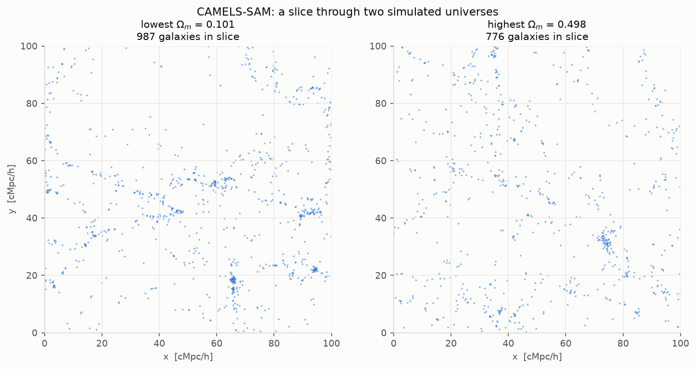
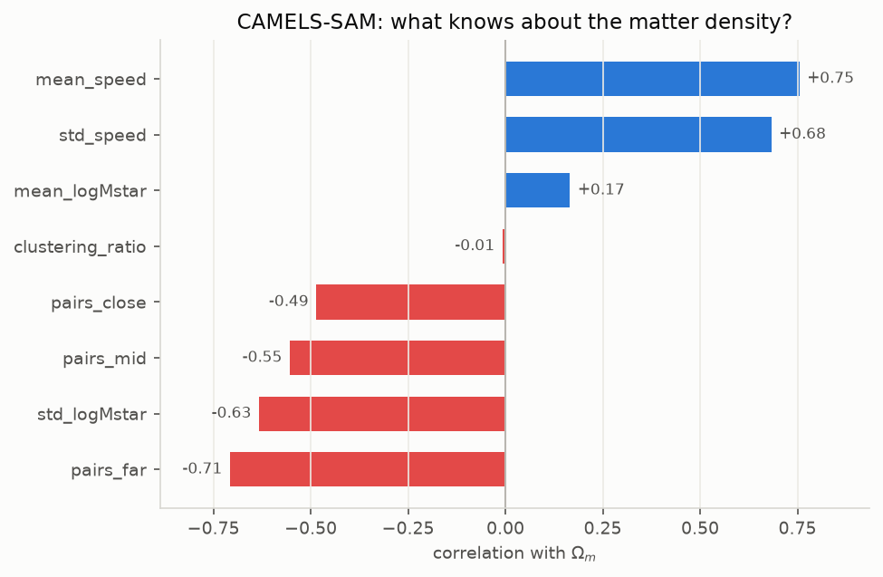
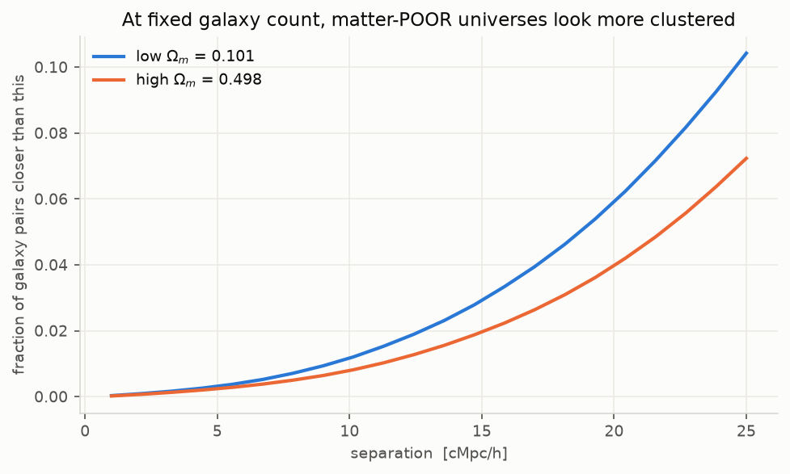

# Point clouds — what's in the data

Cubes of space with every galaxy's position. Everything here comes from running
`explore.py`, not from the paper.

Shared background (what the two dials mean, the vocabulary) lives in
[../notes/cheatsheet.md](../notes/cheatsheet.md).

---

## 7. How a cloud is stored

One cloud = one simulated universe = a cube of space with every galaxy's
position in it. Stored as **nested HDF5 groups**, one per simulation, with every
property in its **own separate array**:

```
ALL_galaxies_val.hdf5
├── LH/
│   ├── LH_0/                 ← one simulation = one cloud
│   │   ├── X, Y, Z           positions
│   │   ├── VX, VY, VZ        velocities
│   │   ├── Mstar, Mgas       masses
│   ├── LH_1/ ... LH_199/
├── params/                   ← the answers, one per simulation
└── original_ids/
```

To get a cloud you **stack `X`, `Y`, `Z` yourself** — there's no ready-made
table. Note `Mstar` here is **raw**, not logged (opposite to the trees).

The cube **wraps around**: a galaxy at x=99.9 is next to one at x=0.1. Any
distance calculation must account for that.

### The two suites differ

| | CAMELS | CAMELS-SAM |
|---|---|---|
| Box side | 25 cMpc/h | 100 cMpc/h |
| Clouds (val) | 200 | 204 |
| Galaxies per cloud | **762 – 4,511** (varies) | **exactly 5,000** |
| Extra fields | `Mgas`, `Vmax` | `mHI` |
| Nuisance params | 4 (`A_SN1/2`, `A_AGN1/2`) | 3 (`A_sn1/2`, `Aagn1`) |

CAMELS simulates gas, so it has `Mgas`. CAMELS-SAM doesn't. **Anything you build
must handle differing feature sets**, or stick to positions — which is what the
benchmark task actually uses.

### Nuisance parameters

Beyond the two dials, each simulation also varied **supernova and black-hole
feedback strength** (`A_SN*`, `A_AGN*`). These are *not* targets. They're noise:
the same cosmology can look different depending on them.

## 8. What a cloud looks like



A thin slice through two universes — the left has the least matter, the right
the most. You can see galaxies strung along filaments with empty voids between,
which is what "cosmic web" means.

## 9. What the clouds told us

| Cloud summary | CAMELS → Ω\_m | CAMELS → σ\_8 | SAM → Ω\_m | SAM → σ\_8 |
|---|---|---|---|---|
| mean speed | *0.78* | *0.32* | *0.76* | *0.64* |
| n_galaxies | *0.76* | *0.12* | constant | constant |
| close pairs | −0.46 | +0.17 | −0.49 | **+0.72** |
| mid pairs | −0.24 | +0.36 | −0.55 | **+0.64** |
| far pairs | −0.20 | +0.38 | **−0.71** | +0.45 |
| clustering ratio | −0.70 | −0.15 | −0.01 | **+0.57** |
| spread of galaxy masses | +0.11 | +0.21 | **−0.63** | −0.02 |

*Italic entries are traps — see below.*



### Two traps that look like great results

**Velocity is not an input.** `mean_speed` correlates +0.78, the strongest number
in the table. But the benchmark feeds the model **positions only** — velocities
are the answer to a *different* task. Using them isn't a result, it's looking at
the answer sheet.

**Counting galaxies is a documented shortcut.** In CAMELS, `n_galaxies` scores
+0.76 for Ω\_m. That's because a halo only gets counted once it contains ~20
simulation particles, and particle mass depends on Ω\_m — so **counting alone
leaks the answer without using structure at all.** The paper flags this
explicitly. It's exactly why CAMELS-SAM and Quijote ship fixed-size "top 5000"
files, where `n_galaxies` is constant and the shortcut is closed.

**This is why CAMELS-SAM is the better suite to work with.**

### Clustering runs backwards from intuition



More matter should mean more clustering. **It's the opposite**: `far pairs`
scores **−0.71** with Ω\_m, and the low-Ω\_m curve sits clearly above the high one.

The cause is *selection*, not physics. These files keep the **5,000 most massive
galaxies** whatever the cosmology. In a matter-poor universe massive galaxies
are rare, so the top 5,000 sit in the most extreme density peaks — and rare
peaks cluster hard. Matter-rich universes make massive galaxies common, so the
same cut picks ordinary, weakly-clustered objects.

**σ\_8 behaves normally** (+0.72 for close pairs): lumpier really does mean more
clustered. So the two dials push clustering in **opposite directions**, which is
part of why separating them is hard.

---

---

## Where the difficulty is

| Task | Best published R² |
|---|---|
| Ω\_m from clouds (Quijote) | 0.85 |
| σ\_8 from clouds (Quijote) | 0.84 |
| σ\_8 from clouds (CAMELS) | **0.30** ← very hard |

Note the benchmark feeds these models **positions only** — no mass, no
velocity. See [../notes/plans.md](../notes/plans.md) §8 for why.

## Code here

```bash
python point_clouds/explore.py     # 5 sections, plots 07-10
python point_clouds/load.py        # print one cloud in detail
```

| File | Contents |
|---|---|
| `load.py` | reading clouds, summarising them |
| `explore.py` | the analysis, 5 numbered sections matching this document |
| `training/` | (empty for now) |
| `validate/` | (empty for now) |
